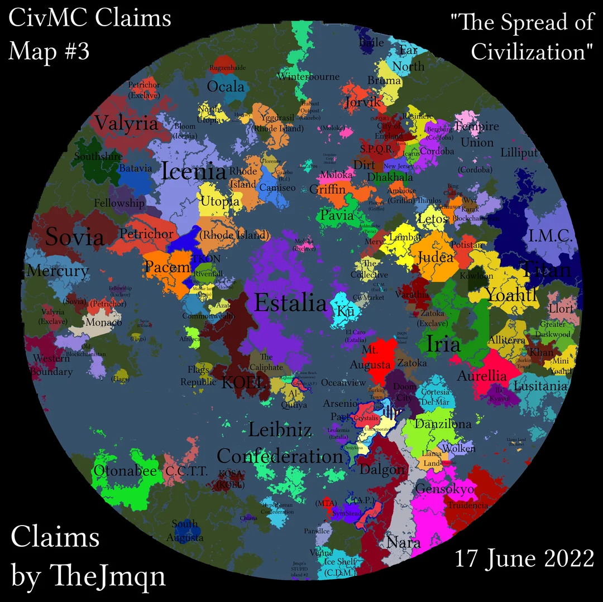
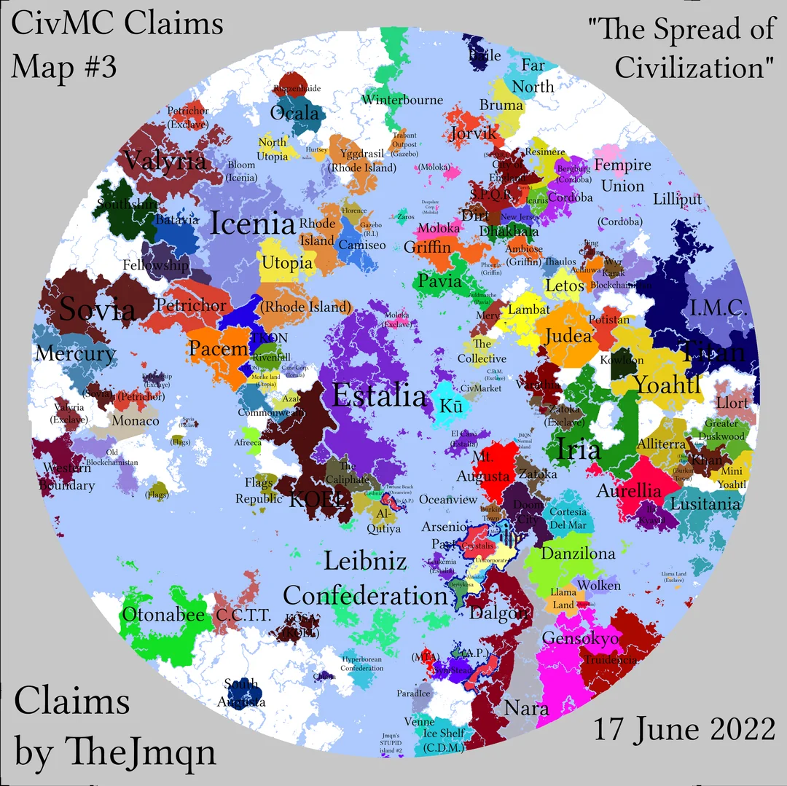

+++
date = '2022-06-17T20:28:20+00:00'
draft = false
title = 'Claims #3 "The Spread of Civilization"'
+++

Source: [https://www.reddit.com/r/CivMC/comments/vepb0y/civmc_unofficial_claims_map_3_the_spread_of/](https://www.reddit.com/r/CivMC/comments/vepb0y/civmc_unofficial_claims_map_3_the_spread_of/)

TheJmqn: *All land is now (hopefully) mapped out, Please read comments for important advertisement project I am working on that all nations are invited and encouraged to participate in (please participate)*

