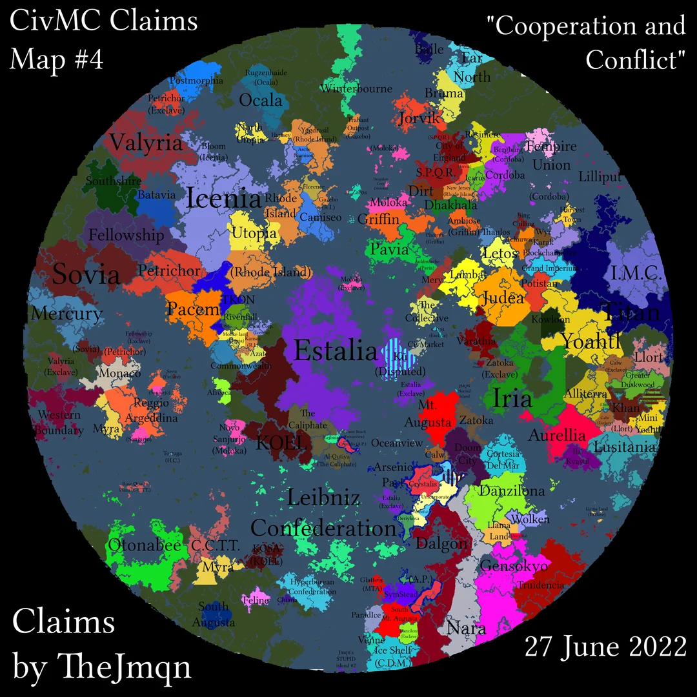
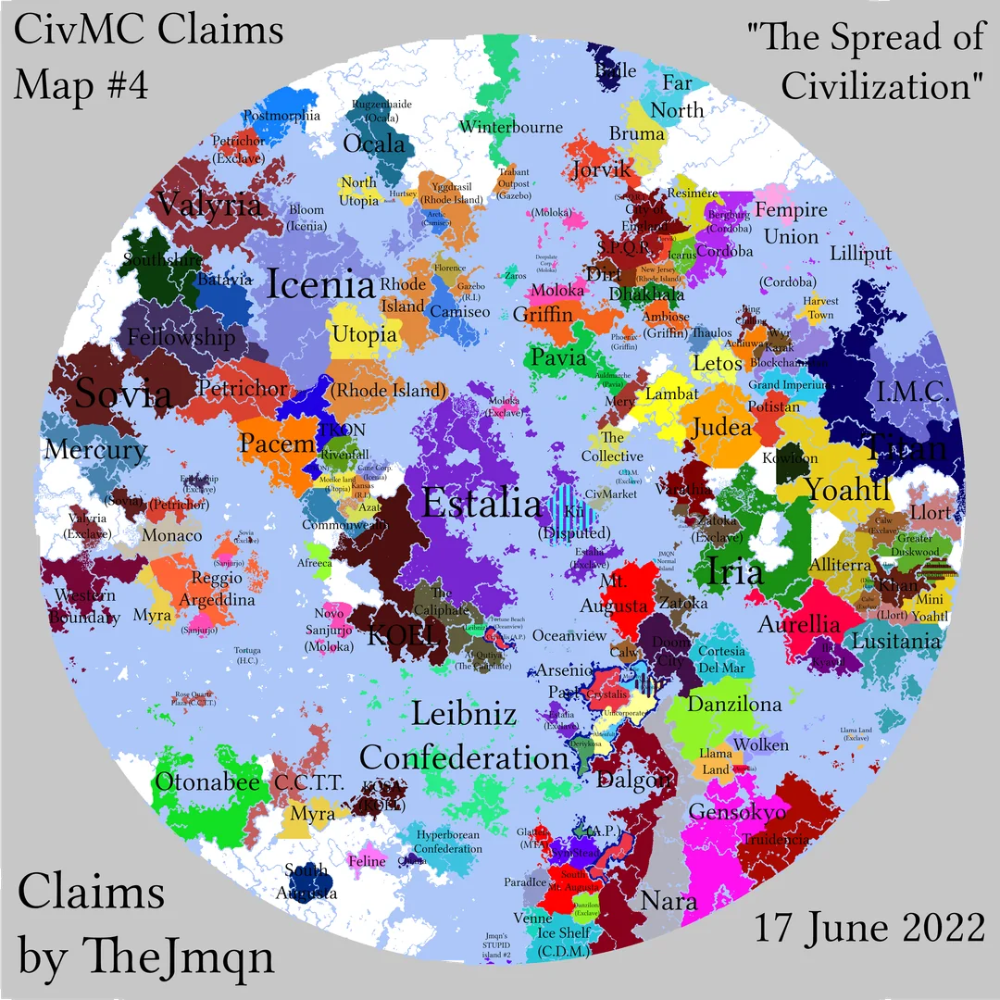

+++
date = '2022-06-27T22:55:21+00:00'
draft = false
title = 'Claims #4 "Cooperation and Conflict"'
+++

Source: [https://www.reddit.com/r/CivMC/comments/vm7vgu/civmc_unofficial_claims_map_4_cooperation_and/](https://www.reddit.com/r/CivMC/comments/vm7vgu/civmc_unofficial_claims_map_4_cooperation_and/)

TheJmqn: *Remember that this map shows de jure claims, not de facto control. The third image has some organizations and alliances across the server.*

